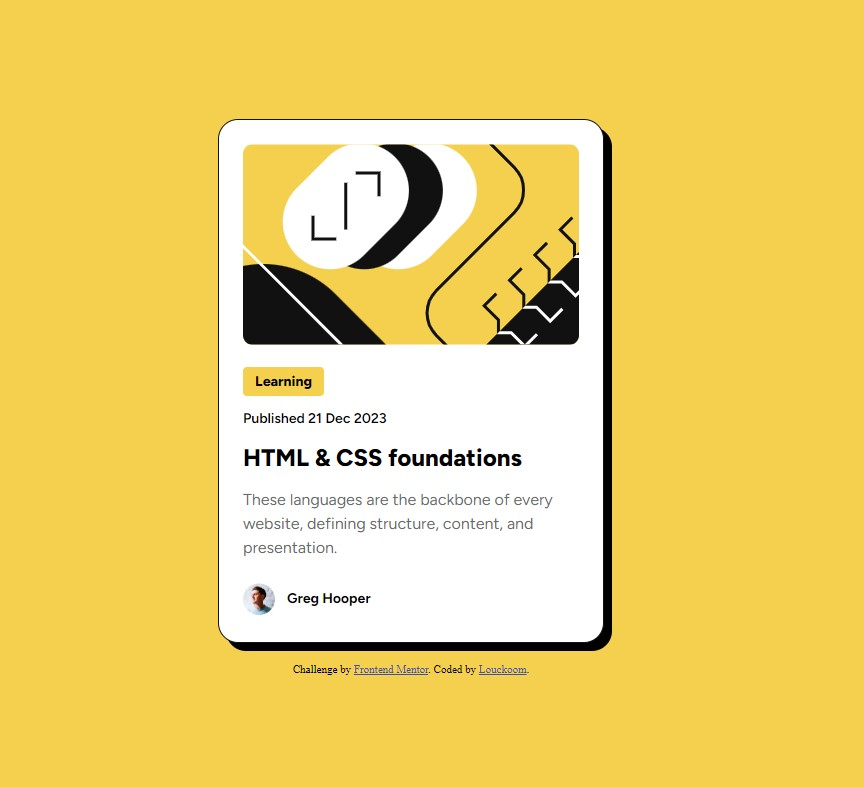

# Frontend Mentor - Blog preview card solution

This is a solution to the [Blog preview card challenge on Frontend Mentor](https://www.frontendmentor.io/challenges/blog-preview-card-ckPaj01IcS). Frontend Mentor challenges help you improve your coding skills by building realistic projects. 

## Table of contents

- [Overview](#overview)
  - [The challenge](#the-challenge)
  - [Screenshot](#screenshot)
  - [Links](#links)
- [My process](#my-process)
  - [Built with](#built-with)
  - [Continued development](#continued-development)
  - [Useful resources](#useful-resources)
- [Author](#author)
- [Acknowledgments](#acknowledgments)

## Overview

### The challenge

The challenge is to build out this blog preview card and get it looking as close to the design as possible.

Users should be able to:

- See hover and focus states for all interactive elements on the page

### Screenshot

### Links

- Solution URL: [https://github.com/Louckoom/Blog_Preview_Card]
- Live Site URL: [https://louckoom.github.io/Blog_Preview_Card/]

## My process

- First i build the HTML create divs into specific order.
- Then i import the font in HTML using "Link".
- Then i create the CSS file and link with the HTML file.
- Then i begin fill elements style with color and font.
- Then i use flexbox to align elements and have correct spacing.
- Finally i adjust some minor details to be as same as possible of the original design.

### Built with

- Semantic HTML5 markup
- CSS custom properties
- Flexbox

### Continued development

- I want to learn more about layout and responsive design.

### Useful resources

- [Flexbox Froggy](https://flexboxfroggy.com/#fr) - This helped me for using properly flexbox.

## Author

- Frontend Mentor - [@Louckoom](https://www.frontendmentor.io/profile/Louckoom)
- Twitch - [@luckyciel](https://www.twitch.tv/luckyciel)
- Github - [@Louckoom](https://github.com/Louckoom)

## Acknowledgments

Did all by myself.

